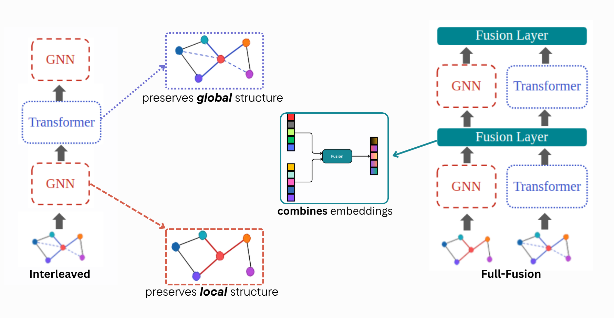

# Think Global And Local: Graph Learning on Tabular Data - Interleaved and Full Fusion Architectures
This repository contains the code for the paper "Graph Learning on Tabular Data: Think Global And Local - Full Fusion and Interleaved architectures on IBM’s Anti-Money Laundering Data".



# Table of Contents
- [Think Global And Local: Graph Learning on Tabular Data - Interleaved and Full Fusion Architectures](#think-global-and-local-graph-learning-on-tabular-data---interleaved-and-full-fusion-architectures)
  - [Table of Contents](#table-of-contents)
  - [Setting up](#setting-up)
    - [Set up Locally](#set-up-locally)
    - [Set up for DAIC](#set-up-for-daic)
  - [Data](#data)
  - [Parameters](#Parameters)

## Set up Locally

- Create a new Conda environment, and activate.
```bash
conda env create -f env.yml
conda activate aml-env

```
- Install Pytorch and Pytorch Geometric
```bash
conda install pytorch==2.2.2 torchvision==0.17.2 torchaudio==2.2.2 pytorch-cuda=11.8 -c pytorch -c nvidia
conda install pyg -c pyg
pip install -r requirements.txt
```

To run a model, you can use the following command:
```bash
python main.py --model <model_name> --dataset <dataset_name> --n_epochs <number_of_epochs> \
     --batch_size <batch_size> --emlps --testing --save_model --output_dir <output_directory> --data_dir <data_directory>
```
Where:
- `<model_name>` can be `interleaved`, `full_fusion`,`pna`, `megapna`;
- `<dataset_name>` is the name of the dataset you want to use (e.g., `Small_HI`),

 and the other parameters are optional, as they have default init.


## Set up for DAIC/ Apptainer-based SLURM environment

Use the `Apptainer.def` file to change the data stored and behavior of the container. Currently, it is set up to run the same commands as the ones indicated above. 

To create the image file, run 
```bash
apptainer build <container_name>.sif Apptainer.def
```

To deploy on DAIC, you can use the `sbatch.execute.slurm` file configured for the DAIC cluster. Don't forget to change the `${container_name}` variable to the name of your container.
Then send the files (`.sif` file, `sbatch.execute.slurm`) to the DAIC cluster. You can use `scp` for that:

```bash
scp (-r) /path/to/your/project/<container_name>.sif <netid>@login.daic.tudelft.nl:/path/to/your/directory
```

After that, you can run the following command to submit the job:

```bash
sbatch sbatch.execute.slurm
```
Don't forget to change the `${container_name}` variable in the `sbatch.execute.slurm` file to the name of your container, and other specific parameters for your experiment.


# Data
The data needed for the experiments can be found on [Kaggle - IBM's AML dataset](https://www.kaggle.com/datasets/ealtman2019/ibm-transactions-for-anti-money-laundering-aml/data).


# Parameters
The parameters used in the experiments whose results are shown in the paper can be found in the `params` folder. The parameters are stored in YAML format and grouped by dataset. Within each dataset folder, parameter can be identified by name, which contains architecture and sophistications. For example `F_Interleaved_MEGA.yaml` contains the parameters used for testing the Interleaved architecture with the MEGA-PNA GNN.
